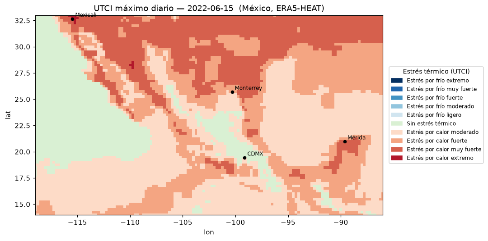

# atlas — visor de estrés térmico UTCI para México

Visor interactivo del índice **UTCI** (*Universal Thermal Climate Index*, la
temperatura "de sensación" que integra aire, humedad, viento y radiación) sobre
México, a partir del dataset **ERA5-HEAT** de Copernicus. Inspirado en la
arquitectura de [Thermal Trace](https://thermaltrace.climate.copernicus.eu),
scopeado a México y pensado como base del *Atlas Nacional de Vulnerabilidad
Energética* (IER-UNAM).

La app deja elegir una **fecha** y un **índice/agregación**, computa el campo 2D
al vuelo con xarray sobre un cubo **Zarr**, lo pinta en un mapa interactivo y, al
hacer **clic** en un punto, grafica la **serie temporal horaria** de esa celda.



## Requisitos

- [`uv`](https://docs.astral.sh/uv/) (gestión de Python y dependencias).
- Python ≥ 3.13 (lo provee `uv`).

> El proyecto se gestiona **exclusivamente con `uv`**. No uses `pip` ni venvs manuales.

## Puesta en marcha

```bash
# 1. Instalar dependencias (crea el entorno y compila el paquete `atlas`)
uv sync

# 2. Construir el cubo Zarr desde los NetCDF de ERA5-HEAT
#    (espera los archivos en data/raw/<TIPO>/<AÑO>/*.nc)
uv run atlas-ingest UTCI 2022

# 3. Arrancar la app
uv run shiny run app/app.py
# abre http://127.0.0.1:8000
```

## Datos

Los datos viven **fuera de Git** (`data/`, ignorado). Layout canónico:

```
data/
├─ raw/UTCI/2022/ECMWF_utci_YYYYMMDD_v1.1_*.nc   # NetCDF fuente (ERA5-HEAT)
└─ utci_mexico.zarr/                              # cubo construido por la ingesta
```

El recorte es México continental + mar adyacente (lon −119…−86, lat 14…33) a
0.25° (77×133 celdas), horario. La ingesta:

- normaliza unidades (Kelvin → °C),
- ordena lat ascendente y el tiempo,
- escribe el cubo con chunk diario (`time=24`),
- es **idempotente** (re-ingerir un año no duplica) y soporta **append** de años
  posteriores (`atlas-ingest UTCI 2023`, …).

> El tiempo del cubo está en **UTC**; las series horarias se etiquetan como UTC.

## Arquitectura

Cuatro capas desacopladas; el núcleo de cómputo no depende de Shiny.

```
NetCDF (ERA5-HEAT)
   │  atlas-ingest  (atlas/ingest.py)
   ▼
data/utci_mexico.zarr            ← cubo (time, lat, lon)
   │  atlas/catalog.py  (open_cube perezoso, fechas/variables)
   ▼
atlas/indices.py   registro PLUGGABLE de índices  ──┐
atlas/compute.py   field_for(fecha, índice) / series_at(lat, lon)
atlas/render.py    campo 2D → PNG (colormap de estrés) + leyenda
atlas/plots.py     serie horaria → figura
   │
   ▼
components/  (Shiny: panels, servers, shared)  +  app/app.py
```

- **`src/atlas/`** es un **paquete instalable** (layout `src/`, listo para pip).
  Cubre ingesta + cómputo + render. Expone el comando `atlas-ingest`.
- **`components/` + `app/`** son la capa de aplicación (Shiny) que consume el paquete.
- **Mapa**: `ipyleaflet` (vía `shinywidgets`) con `ImageOverlay`. A 0.25° el campo
  entero (~10k celdas) se rasteriza a un PNG y se pinta al instante; no hace falta
  tiling.

### Índice pluggable (extensibilidad)

El diferenciador de investigación: un índice es una función pura sobre el cubo
horario, registrada en `atlas/indices.py`. Agregar uno nuevo (p. ej. IMAC o
grados-hora de confort adaptativo) es registrar un `Index` más — la UI lo recoge
automáticamente, sin tocar la app.

```python
from atlas.indices import Index, register

register(Index(
    key="utci_max_diario",
    label="UTCI máximo diario",
    units="°C",
    var="utci",
    aggregate=lambda da: da.max("time", keep_attrs=True),  # día horario → campo 2D
    categories=UTCI_STRESS,        # tabla ECMWF de 10 clases (opcional)
    classify=classify_utci,
))
```

## Demos (sin navegador)

```bash
uv run python scripts/demo_m2.py   # campo, distribución de estrés, ciudades, serie (texto)
uv run python scripts/demo_m3.py salida.png   # vista previa del campo coloreado
uv run python scripts/demo_m4.py salida.png   # serie horaria que produce un clic
```

## Estructura del repo

```
src/atlas/      paquete instalable (config, ingest, catalog, indices, compute, render, plots, cli)
components/      capa Shiny (shared, panels, servers)
app/app.py       ensamblado de la app
scripts/         demos
docs/PLAN.md     plan e hitos
data/            datos (fuera de Git)
```

## Fases futuras (fuera de alcance v1)

Anotadas, **no** construidas todavía:

- Tiling dinámico / TiTiler / COG (innecesario a esta resolución).
- Anomalías vs climatología 1991-2020; escalas estacional y anual.
- Capas INEGI nivel AGEB y cruces de vulnerabilidad energética.
- Almacenamiento DuckLake / Parquet / Icechunk.
- Índices propios de confort adaptativo (IMAC, grados-hora) vía el registro de
  índices — el diferenciador de la investigación.
- Hora local de México (hoy las series se muestran en UTC).
- Entry point `atlas-app` para arrancar la app como comando.
